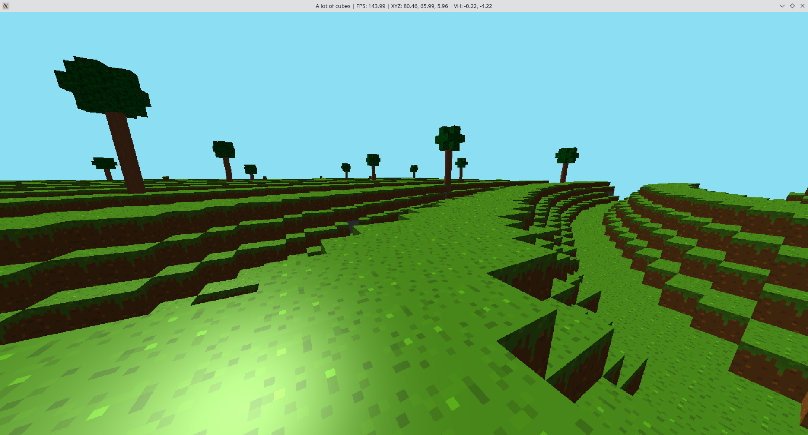
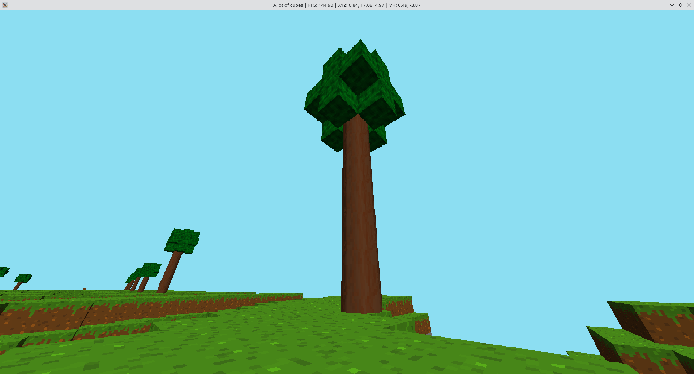
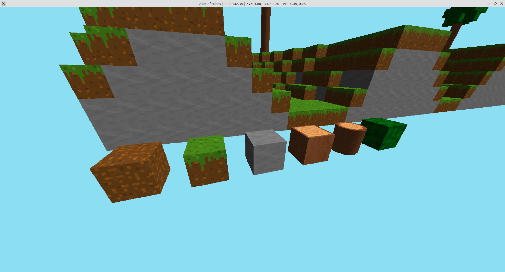

# LotofCubes

Welcome to **LotofCubes**! This project is a 3D prototype of a Minecraft-like game, serving as an experimental platform for exploring 3D graphics and texture loading techniques. As a pre-alpha work-in-progress, LotofCubes is continuously evolving with new features and improvements.

## Features

- **3D Environment**: Basic 3D world terrain.
- **Texture Loading**: Experimentation with various texture loading techniques.
- **Voxel-Based System**: Prototype for a voxel-based world, akin to Minecraft.

## Screenshots

Here are some early screenshots showcasing the current state of the project:


*Screenshot 1: Overview of the 3D environment.*


*Screenshot 2: Close-up view of the voxel terrain.*


*Screenshot 3: Demonstration of texture loading in action.*

## Getting Started

To get started with LotofCubes, follow these steps:

### Prerequisites

- **Rust**: Ensure you have Rust installed. You can get it from [rust-lang.org](https://www.rust-lang.org/).
- **OpenGL**: The project uses OpenGL for rendering. Make sure your system supports it.

### How to run

Simple, you just do:
```bash
$ cargo run --release
```

Thats all. Obviously, you also need Rust Cargo installed.